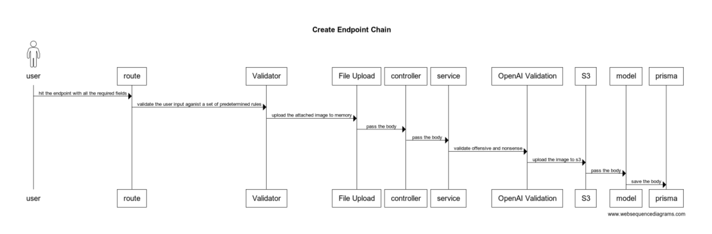

# Nawy Backend Project Documentation

# Property API Documentation

## Endpoints

### Get All Properties

GET `/api/v1/property`

Retrieve a paginated list of properties.

#### Query Parameters

- `page` (optional): Page number (default: 1)
- `size` (optional): Items per page (default: 10, max: 20)

#### Success Response

```json
{
  "data": [
    {
      "id": "string",
      "name": "string",
      "description": "string",
      "price": "number",
      "rooms": "number",
      "size": "number",
      "imageUrl": "string"
    }
  ],
  "page": "number",
  "size": "number",
  "total": "number"
}
```

### Get Single Property

GET `/api/v1/property/:id`

Retrieve detailed information about a specific property, including its address, developer, and project details.

#### Parameters

- `id` (required): The unique identifier of the property

#### Success Response

Status Code: 200

```json
{
  "id": "string",
  "name": "string",
  "description": "string",
  "price": "number",
  "rooms": "number",
  "size": "number",
  "floor": "number | null",
  "addressId": "string",
  "imageUrl": "string",
  "createdAt": "string",
  "updatedAt": "string",
  "developerId": "string",
  "projectId": "string",
  "address": {
    "id": "string",
    "street": "string",
    "city": "string",
    "zip": "string",
    "country": "string",
    "createdAt": "string",
    "updatedAt": "string"
  },
  "developer": {
    "id": "string",
    "name": "string",
    "description": "string",
    "createdAt": "string",
    "updatedAt": "string"
  },
  "project": {
    "name": "string",
    "createdAt": "string",
    "updatedAt": "string"
  }
}
```

#### Failure Response

Status Code: 404

```json
{
  "success": false,
  "errorCode": 404,
  "errorType": "Notfound error",
  "errors": [
    {
      "message": "Property not found"
    }
  ]
}
```

### Create Property

POST `/api/v1/property`

Create a new property listing.

#### Flow



#### Request

Content-Type: `multipart/form-data`

#### Request Body Parameters

| Field                | Type   | Required | Description                      |
| -------------------- | ------ | -------- | -------------------------------- |
| name                 | string | Yes      | Property name                    |
| description          | string | Yes      | Property description             |
| price                | number | Yes      | Property price                   |
| rooms                | number | Yes      | Number of rooms                  |
| size                 | number | Yes      | Property size in square meters   |
| street               | string | Yes      | Street address                   |
| city                 | string | Yes      | City name                        |
| zip                  | string | Yes      | ZIP/Postal code                  |
| country              | string | Yes      | Country name                     |
| developerName        | string | Yes      | Developer name                   |
| developerDescription | string | Yes      | Developer description            |
| projectName          | string | Yes      | Project name                     |
| image                | file   | Yes      | Property image (JPEG, PNG, WebP) |

#### Validation Rules

| Field                    | Validation Rules                                                         |
| ------------------------ | ------------------------------------------------------------------------ |
| **name**                 | - Required<br>- Minimum 5 characters                                     |
| **description**          | - Required<br>- Minimum 10 characters                                    |
| **price**                | - Required<br>- Must be a number<br>- Must be greater than 0             |
| **rooms**                | - Required<br>- Must be an integer<br>- Must be greater than 0           |
| **size**                 | - Required<br>- Must be a number<br>- Must be greater than 0             |
| **street**               | - Required<br>- Minimum 5 characters                                     |
| **city**                 | - Required<br>- Minimum 5 characters                                     |
| **zip**                  | - Required<br>- Minimum 3 characters                                     |
| **country**              | - Required<br>- Minimum 2 characters                                     |
| **developerName**        | - Required<br>- Minimum 2 characters                                     |
| **developerDescription** | - Required<br>- Minimum 10 characters                                    |
| **projectName**          | - Required<br>- Minimum 2 characters                                     |
| **image**                | - Required<br>- Must be JPEG, PNG, or WebP format<br>- Maximum size: 5MB |

#### Success Response

Status Code: 201

```json
{
  "id": "string",
  "name": "string ",
  "description": "string",
  "price": "float",
  "rooms": "Integer",
  "size": "Float",
  "floor": "Integer",
  "addressId": "String",
  "imageUrl": "string",
  "createdAt": "DateTime",
  "updatedAt": "DateTime",
  "developerId": "String",
  "projectId": "String"
}
```

#### Failure Response

Status Code: 400

```json
{
  "status": "error",
  "errorCode": 400,
  "errorType": "Bad Request",
  "errors": [
    {
      "message": "Invalid request body"
    }
  ]
}
```

### Search Properties

GET `/api/v1/property/search`

Search for properties by name, description, developer name, or project name.

#### Query Parameters

- `query` (required): Search term to filter properties

#### Success Response

Status Code: 200

```json
{
    [
        {
            "id": "string",
            "name": "string",
            "description": "string",
            "price": "number",
            "rooms": "number",
            "size": "number",
            "imageUrl": "string"
        }
    ]

}
```
